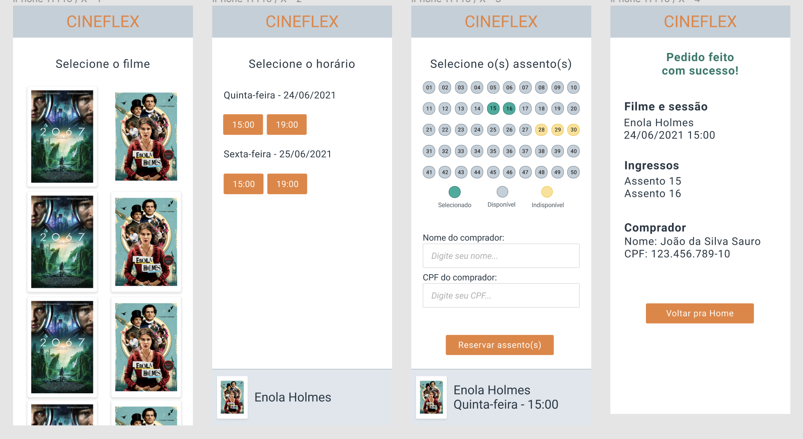

<h1 align="center">Cineflex - ReactJS </h1>

✅ Requisitos
 - Geral
    - [x]  Manipule o HTML usando somente React (sem usar o document nem bibliotecas como jQuery).
    - [x]  Seu projeto deverá ser desenvolvido utilizando Git e GitHub.
    - [x]  **A cada requisito implementado** faça um commit com uma mensagem descritiva do que você evoluiu. Caso queira dividir um requisito em vários commits, não há problema. Mas evite colocar mais de um requisito no mesmo commit.
    - [x]  O uso de styled-components é obrigatório.
    - [x]  Não é permitido o uso de context.
- Versionamento
    - [x]  Versionamento usando Git é obrigatório, crie um **repositório público** no seu perfil do GitHub.
    - [x]  Faça *commits* a cada funcionalidade implementada.
- *Layout*
    - [x]  Vocês já reveberam o layout das páginas com todos os styled-components necessários feitos. Baixe o arquivo em Recursos > Layout pronto
        - A ideia é aproveitar o CSS, não a lógica (é tudo estático) nem organização dos arquivos (você deve criar componentes conforme achar adequado)
        - Não esqueça de colocar os `data-test`!
    - [x]  O *layout* é apenas para mobile, seguindo figma fornecido (não é necessário implementar um layout para desktop).
    - [x]  Use as exatamente cores indicadas no Figma para assento “Disponível”, “Selecionado” e “Indisponível”.
- Escolha de Filme (rota `/`)
    - [x]  Buscar as informações dos filmes pela API fornecida e exibir conforme layout fornecido.
    - [x]  Ao clicar em um filme, o usuário deve ser redirecionado para a rota `/sessoes/:idFilme`, sendo `:idFilme` o id do filme clicado.
- Escolha de Sessão (rota `/sessoes/:idFilme`)
    - [x]  A partir do id da URL, obtenha da API as sessões disponíveis para o filme e exiba conforme o *layout* fornecido.
    - [x]  Ao clicar em uma sessão, o usuário deve ser redirecionado para a rota `/assentos/:idSessao`, onde `:idSessao` é o id da sessão escolhida.
- Escolha de Assento (rota `/assentos/:idSessao`)
    - [x]  A partir do id da sessão, buscar os dados da sessão da API e exibir o layout conforme fornecido.
    - [x]  Ao clicar em um assento disponível, o assento deve ser marcado como "Selecionado".
    - [x]  Ao clicar novamente em um assento selecionado, este deve voltar para "Disponível".
    - [x]  Ao clicar em um assento indisponível, deverá ser exibido um alerta de "Esse assento não está disponível".
    - [x]  O usuário pode selecionar vários assentos.
    - [x]  O usuário deve poder inserir o nome e o CPF do comprador.
    - [x]  Ao clicar em "Reservar assento(s)", o pedido deve ser enviado para o servidor e o usuário deve ser redirecionado para a rota `/sucesso`.  Isso fará com os assentos marcados fiquem indisponíveis para outras marcações.
- Rodapé
    - [x]  Ao longo das telas de Sessão e Assento, deve ser exibido um rodapé com as informações do filme selecionado. Estas informações virão das chamadas à API em cada tela.
- Sucesso (rota `/sucesso`)
    - [x]  Implementar *layout* conforme fornecido, exibindo os dados do pedido feito.
    - [x]  Ao clicar em "Voltar para Home" o usuário deve voltar para a rota inicial (`/`), com o pedido zerado.

## 🛠 &nbsp;Skills

  
  
  
  
          
  
                                     

## 🚀 &nbsp;Links

- [Figma](https://www.figma.com/file/xt4dsKrSryDMuTaSaEBuwV/Cineflex?node-id=0%3A1&t=1ooZT6EER0yP5N7Y-0). 
- [Deploy](https://projeto10-cineflex-eight-dun.vercel.app/). 

## 💬 &nbsp;Contact

Feito por [Raissa Curty](https://github.com/curtyraissa)!

&nbsp;
